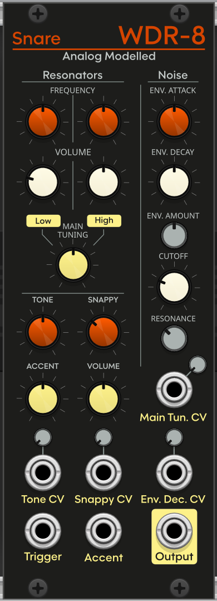

# WDR-8

### Wave Digital Rhythm drum machine, based on TR-808

__:floppy_disk: Download nightly builds [here](https://github.com/Simon-L/WDR-8/releases/tag/Nightly)__

## WDR-8 Snare

This module emulates the TR-808 snare as faithfully as possible while providing precise control over various parts to allow different snare and percussion sounds to be possible.  
As with the original, it is made of two "resonators", high and low, representing the ringing of the drum shell when hit. The other part is made from noise (more precisely violet noise), shaped by an envelope generator that I believe is very important to get the 808 sound.  
In the (near?) future, I plan to assemble the actual white noise source circuit and analyse it to make the noise used in the module closer to the original.

[Original schematics](docs/fullsnareschematics.png)

W.N = White noise  
Trigger comes from top left  

This module uses WDF models for :  
- A simplified envelope generator (Q47) with adjustable R and C compononents
- The low shell resonator (IC 14, left) with the shaper at the input
- The high shell resonator (IC 14, right)
- A very simplified diode clipper used as the base for the VCA (Q48)

The high pass filter (Q49, C66, C67, R201, R202) is not simulated, instead a matching 2-pole Butterworth HPF from ChowDSP is used.  
IC 13 has not been analysed and is considered ideal, the Volume knob has this purpose.

The shell resonators are the work of Jatin Chowdhury, as part of the WaveDigitalFilters repo: https://github.com/jatinchowdhury18/WaveDigitalFilters/tree/master/TR_808/SnareResonator/src  

The programming of this module was the easiest part, most of the time was spent running electronics simulation in a software called LTspice, it has allowed me to simulate and understand the various parts of the complete snare drum circuit and calibrate this real time software version so that it matches the simulation as closely as possible.  
It goes without saying that the work also paves the way for other 808 instruments, as well as other Roland drum machines!

## Design

Fonts: [Olyford Semi Bold](https://www.fonts.com/font/nicolassfonts/olyford/semi-bold) and [Noto Sans](https://fonts.google.com/noto/specimen/Noto+Sans)

## Acknowledgments
Many thanks to Jatin Chowdhury, Paulbacon, Steve Norgate, Eric Archer, Kurt J. Werner  

https://norgatronics.blogspot.com/2021/11/sd-8081-tuning.html  
http://www.ericarcher.net/wp-content/uploads/2014/07/808-svc-man.pdf  
https://stacks.stanford.edu/file/druid:jy057cz8322/KurtJamesWernerDissertation-augmented.pdf  
https://github.com/jatinchowdhury18/WaveDigitalFilters  
 
## License
GPL v3
